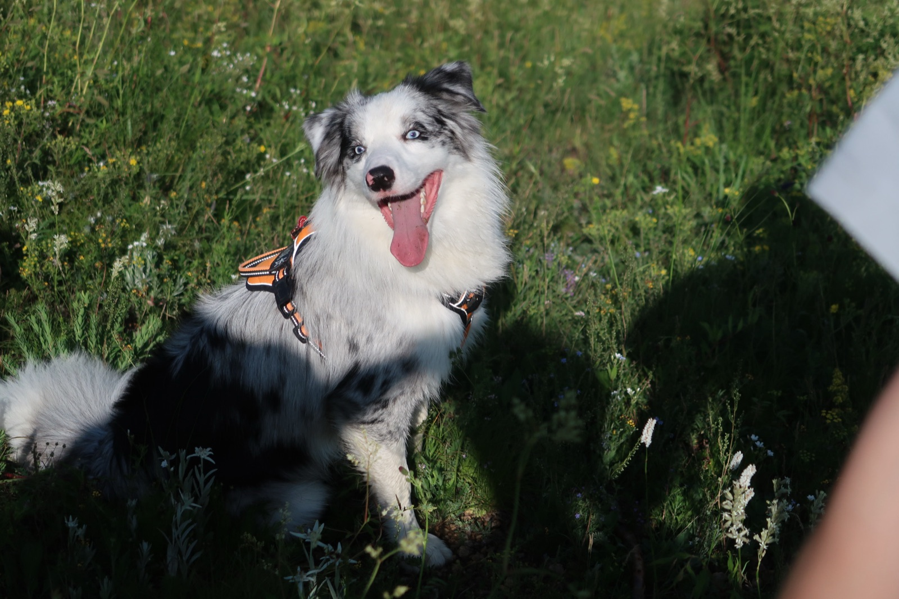
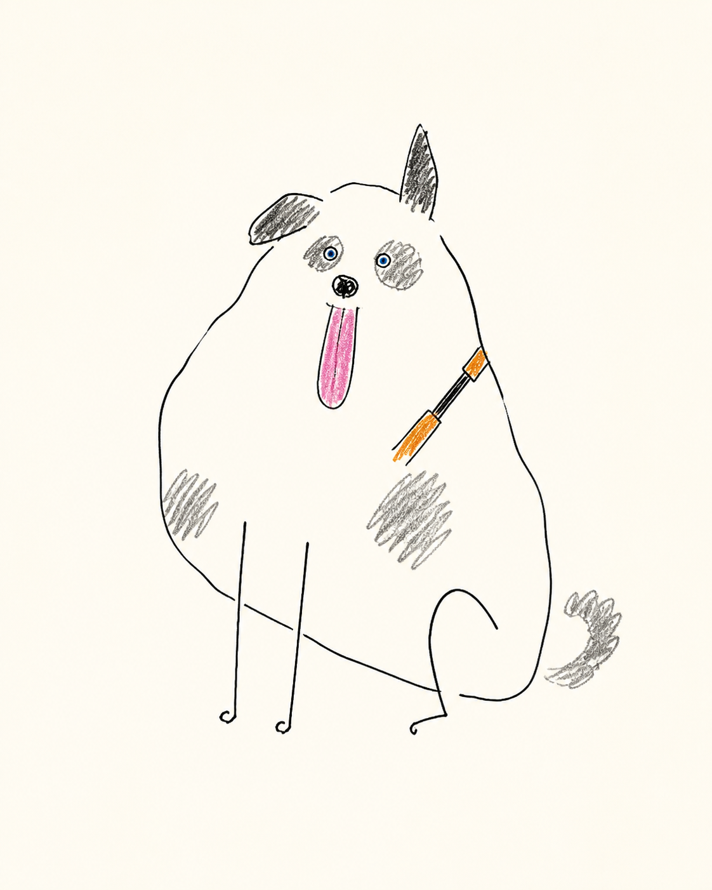
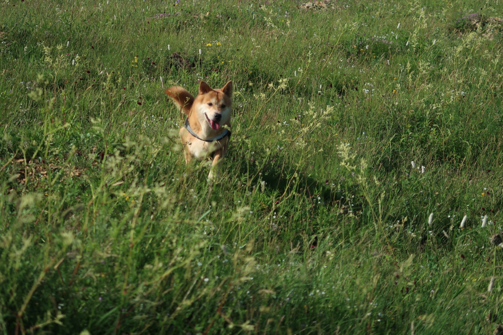
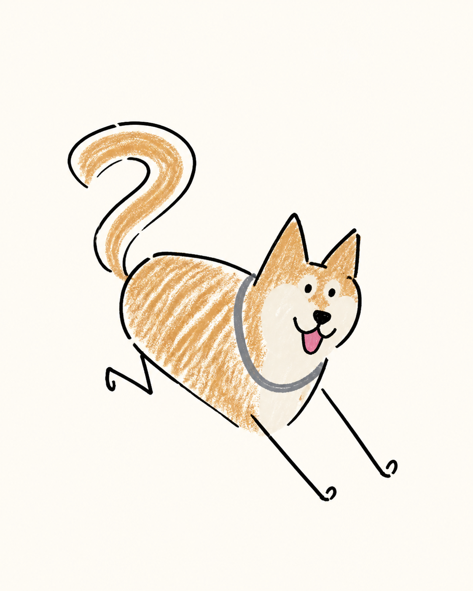
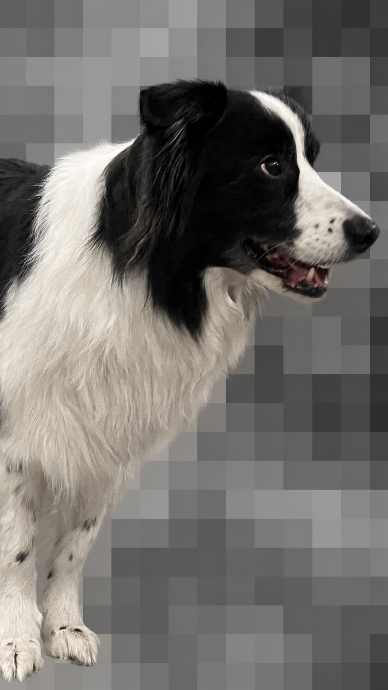
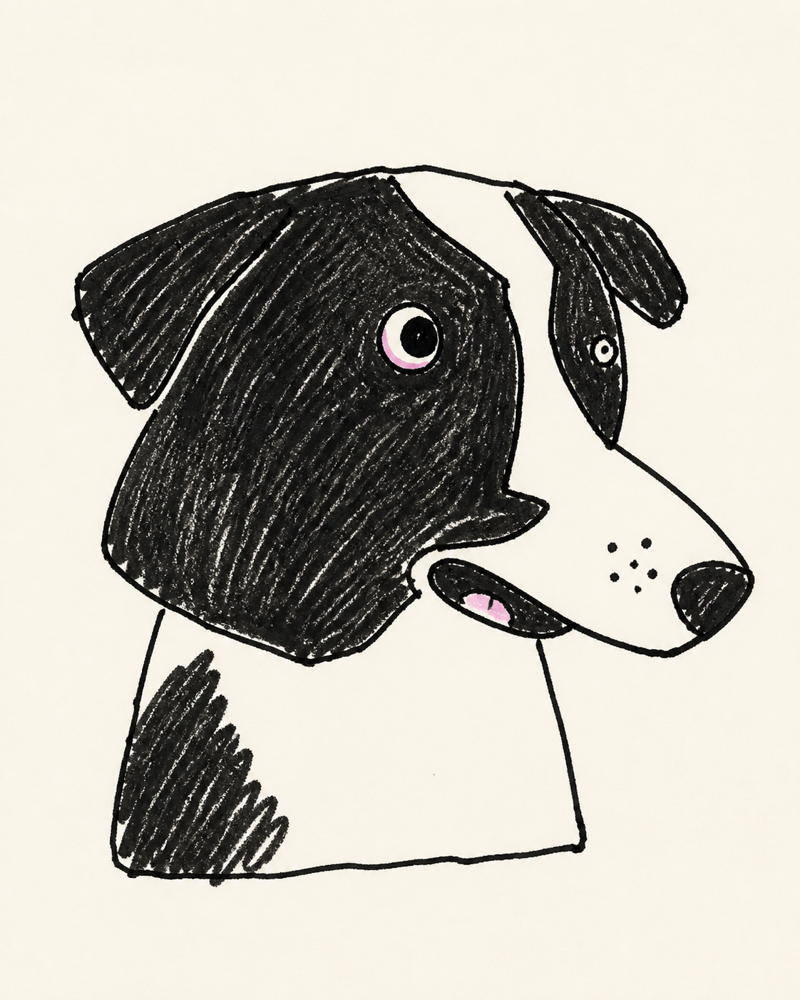

# Naive Dog Doodle

把狗狗照片重新解释成一张稚拙、松弛、仍有辨识度的手绘插画。

这个 Codex skill 不会给照片套滤镜，也不会画成精致宠物肖像。它先从照片中挑出 3–5 个身份符号，再把狗狗压缩成一个荒谬但贴切的主形状，例如云团、豆子、土豆、长方块或几根折线。

## 示例

<table>
  <tr>
    <th>原图</th>
    <th>处理后</th>
  </tr>
  <tr>
    <td></td>
    <td></td>
  </tr>
  <tr>
    <td></td>
    <td></td>
  </tr>
  <tr>
    <td></td>
    <td></td>
  </tr>
</table>

## 风格原则

- 先抽象，后辨识：先选一个大胆主形状，再挂上少量身份特征。
- 允许比例故意错误，但错误必须来自原狗狗的真实特点。
- 使用略抖的黑色毡尖笔轮廓和稀疏彩铅涂痕，保留大量暖白纸面。
- 默认去除照片环境，不生成速写本照片、前后对比图、文字、水印或社交媒体界面。
- 如果照片只展示头肩，不会擅自补画完整身体。

完整规则见 [`SKILL.md`](SKILL.md) 和 [`references/style-guide.md`](references/style-guide.md)。

## 安装

```bash
git clone https://github.com/yikayiyo/naive-dog-doodle.git ~/.codex/skills/naive-dog-doodle
```

重新启动 Codex 或刷新 skill 列表后即可调用。

## 使用

上传一张狗狗照片，然后输入：

```text
使用 $naive-dog-doodle，把这张狗狗照片画成一张稚拙、松弛、有辨识度的手绘插画。
```

也可以直接说：

```text
使用 $naive-dog-doodle 处理这张图中的狗狗。
```

## 目录

```text
naive-dog-doodle/
├── SKILL.md
├── agents/openai.yaml
├── references/style-guide.md
└── examples/
```

示例图由本 skill 在实际调用中生成。图片生成使用 Codex 内置的图像生成能力。
